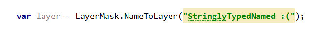
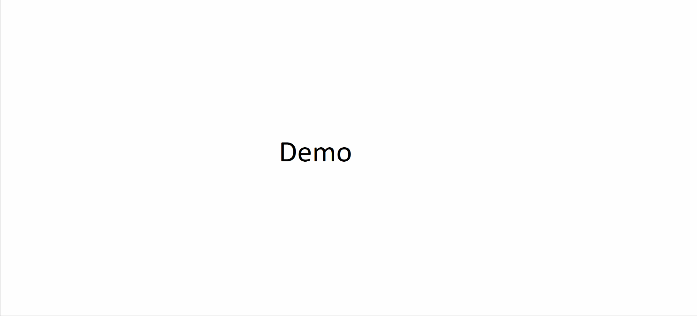

## Unity3D - static C# code generator for Tags, Layers, SortingLayers, Inputs and Scenes
No more stringly-typed code!

* Don't like runtime error because of changed string with layer names?
* Would you like to safely change names of you layers/sorting_layers/inputs/tags without breaking code?
* Do you prefer compile-time errors instead of run-time errors?

Instead of this:

have this:

# Usage

1. Clone to your $REPO/Assets dir.
2. Static classes will get generated. After any changes in Unity static files will get regenerated.
3. Don't .gitignore UnityTypeSafety-generated. Commit generated code to avoid cold-start problem with compilation errors on fresh checkouts. 